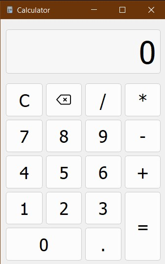

# Calculator

A desktop calculator built with Python and PyQt5. It supports arithmetic expressions, decimal and negative numbers, operator switching, and standard operator precedence.

## Features

- Addition, subtraction, multiplication and division
- Correct operator precedence
- Decimal and negative numbers
- Clear and backspace controls
- Division-by-zero handling
- Standalone Windows executable

## Download

The ready-to-use Windows version is available on the [Releases page](https://github.com/TonyLayt/practik8Calculate/releases/latest).

Download the ZIP archive, extract it and launch `Calculator.exe`. Python is not required.

## Running from source

Python 3.10 or newer is required.

~~~bat
python -m pip install -r requirements.txt
python main.py
~~~

## Built with

- Python
- PyQt5
- Qt Designer
- PyInstaller